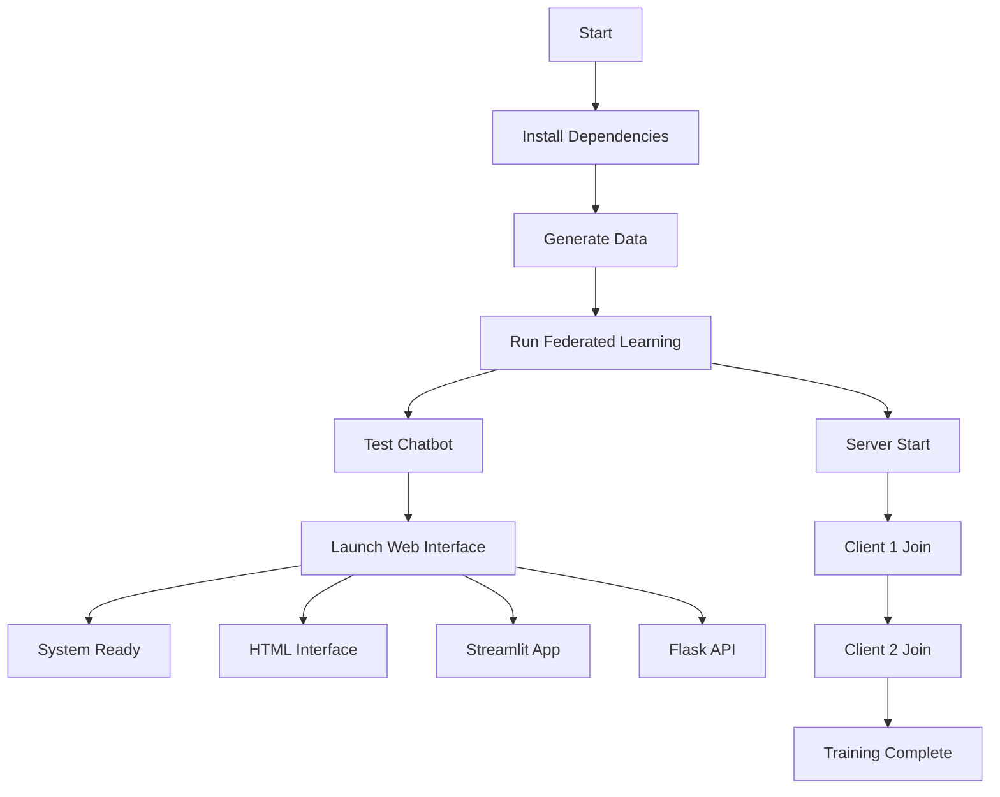

# 🚀 TrialMitra - Complete Execution Guide

## 📋 Quick Start (Recommended)

### **Option 1: One-Click Setup (Easiest)**
```bash
python setup_and_run.py
```
**OR** double-click `run_trialmitra.bat` on Windows

### **Option 2: Manual Step-by-Step**
Follow the detailed steps below for complete control.

---

## 🔧 Manual Step-by-Step Execution

### **Step 1: Install Dependencies**
```bash
pip install flwr pandas numpy scikit-learn streamlit flask matplotlib seaborn
```

### **Step 2: Generate Sample Data**
```bash
python data_generator.py
```
**Output:** Creates `data/` folder with:
- `clinical_trials.csv` (5 trials)
- `hospital1_patients.csv` (200 patients)
- `hospital2_patients.csv` (180 patients)
- `chatbot_interactions.csv` (100 interactions)

### **Step 3: Run Federated Learning**
```bash
python run_federated_learning.py
```
**What happens:**
- Starts federated server
- Launches 2 hospital clients
- Trains for 3 rounds
- Saves models in `models/` folder
- Saves results in `results/` folder

**Expected Output:**
```
=== TrialMitra Federated Learning Simulation ===
Starting federated learning with 2 hospitals...
Hospital 1: Loaded 200 patients
Hospital 2: Loaded 180 patients
Round 1: Global accuracy = 0.763
Round 2: Global accuracy = 0.763
Round 3: Global accuracy = 0.763
Federated learning completed!
```

### **Step 4: Test Individual Components**

#### **Test Chatbot:**
```bash
python chatbot.py
```

#### **Test Individual FL Components:**
```bash
# Terminal 1 - Start Server
python federated_server.py --rounds 3 --min-clients 2

# Terminal 2 - Start Hospital 1 Client
python federated_client.py 1

# Terminal 3 - Start Hospital 2 Client
python federated_client.py 2
```

### **Step 5: Launch Web Interface**

#### **Option A: Standalone HTML (No Server Required)**
- Double-click `trialmitra_ui.html`
- Opens in your default browser
- Fully functional demo interface

#### **Option B: Streamlit Web App**
```bash
streamlit run web_interface.py
```
- Open browser to `http://localhost:8501`
- Full-featured web application

#### **Option C: Flask Web App**
```bash
python flask_app.py
```
- Open browser to `http://localhost:5000`
- Custom API with REST endpoints

---

## 📁 Project Structure After Setup

```
TrialMitra/
├── 📊 data/                          # Generated datasets
│   ├── clinical_trials.csv           # 5 clinical trials
│   ├── hospital1_patients.csv        # 200 patients
│   ├── hospital2_patients.csv        # 180 patients
│   └── chatbot_interactions.csv      # 100 chat logs
├── 🤖 models/                        # Trained FL models
│   ├── global_model_latest.pkl       # Latest model
│   ├── global_model_round_1.pkl      # Round 1 model
│   ├── global_model_round_2.pkl      # Round 2 model
│   └── global_model_round_3.pkl      # Round 3 model
├── 📈 results/                       # Training results
│   └── federated_results.csv         # FL performance metrics
├── 🌐 templates/                     # Web templates
│   └── index.html                    # Flask template
├── 🔧 Core Files
│   ├── data_generator.py             # Dataset generation
│   ├── federated_server.py           # FL server
│   ├── federated_client.py           # FL client
│   ├── chatbot.py                    # Chatbot logic
│   ├── web_interface.py              # Streamlit app
│   ├── flask_app.py                  # Flask web app
│   └── trialmitra_ui.html            # Standalone UI
├── 🚀 Execution Scripts
│   ├── setup_and_run.py              # Complete setup
│   ├── run_trialmitra.bat            # Windows launcher
│   └── run_federated_learning.py     # FL automation
└── 📚 Documentation
    ├── README.md                     # Project overview
    ├── EXECUTION_GUIDE.md            # This guide
    └── requirements.txt              # Dependencies
```

---

## 🎯 Execution Sequence (Integration Order)

### **Phase 1: Data Preparation**
1. `data_generator.py` → Creates all datasets
2. Verify data files in `data/` folder

### **Phase 2: Federated Learning**
1. `federated_server.py` → Starts coordination server
2. `federated_client.py 1` → Hospital 1 joins training
3. `federated_client.py 2` → Hospital 2 joins training
4. Training completes → Models saved in `models/`

### **Phase 3: System Integration**
1. `chatbot.py` → Test chatbot functionality
2. Choose web interface:
   - `trialmitra_ui.html` (standalone)
   - `web_interface.py` (Streamlit)
   - `flask_app.py` (Flask API)

---

## 🔄 Complete Integration Workflow



---

## 🚨 Troubleshooting

### **Common Issues:**

#### **1. Import Errors**
```bash
# Solution: Install missing packages
pip install -r requirements.txt
```

#### **2. Port Already in Use**
```bash
# For Streamlit (port 8501)
streamlit run web_interface.py --server.port 8502

# For Flask (port 5000)
# Edit flask_app.py and change port to 5001
```

#### **3. Federated Learning Fails**
```bash
# Check if data exists
python data_generator.py

# Run components separately
python federated_server.py
# Then in separate terminals:
python federated_client.py 1
python federated_client.py 2
```

#### **4. Model Not Found**
```bash
# Regenerate federated model
python run_federated_learning.py
```

---

## 🎉 Success Indicators

### **✅ System is Ready When:**
- Data folder contains 4 CSV files
- Models folder contains .pkl files
- Results folder contains federated_results.csv
- Web interface opens without errors
- Chatbot responds to queries
- Patient eligibility predictions work

### **📊 Expected Performance:**
- **Global Model Accuracy:** ~76.3%
- **Training Rounds:** 3 completed
- **Total Patients:** 380 (200 + 180)
- **Eligible Patients:** ~106 (27.9%)
- **Available Trials:** 5 active trials

---

## 🔗 Quick Commands Reference

```bash
# Complete setup
python setup_and_run.py

# Individual components
python data_generator.py
python run_federated_learning.py
python chatbot.py

# Web interfaces
streamlit run web_interface.py          # Streamlit
python flask_app.py                     # Flask
start trialmitra_ui.html               # HTML (Windows)

# Manual FL training
python federated_server.py --rounds 3
python federated_client.py 1
python federated_client.py 2
```

---

## 📞 Support

If you encounter issues:
1. Check this guide for troubleshooting steps
2. Verify all dependencies are installed
3. Ensure Python 3.7+ is being used
4. Check that all required files exist
5. Review error messages for specific issues

**Your TrialMitra system is now ready for demonstration and evaluation! 🎊**